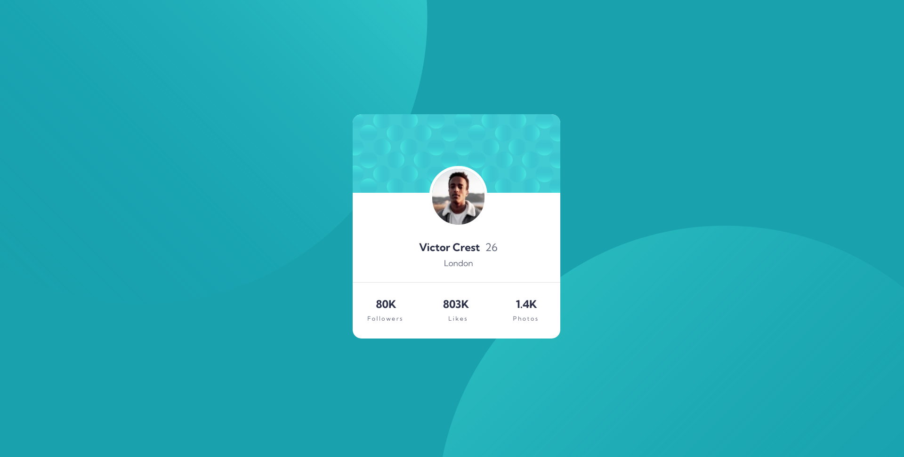

# Frontend Mentor - Profile Card Component

This is a solution to the [Profile Card Component challenge on Frontend Mentor](https://www.frontendmentor.io/challenges/profile-card-component-cfArpWshJ). Frontend Mentor challenges help you improve your coding skills by building realistic projects.

## Table of contents

- [Overview](#overview)
  - [The challenge](#the-challenge)
  - [Screenshot](#screenshot)
  - [Links](#links)
- [My process](#my-process)
  - [Built with](#built-with)
  - [What I learned](#what-i-learned)
- [Author](#author)
- [Acknowledgments](#acknowledgments)

## Overview

### The Challenge

- Challenge is to build out this profile card component and get it looking as close to the design as possible.

### Screenshot

### Links

- Solution URL: [Frontend Mentor Solution]()
- Live Site URL: [Live site]()

## My process

### Built with

- Semantic HTML5 markup
- CSS custom properties
- Flexbox

### What I learned

I learned alot from this challenge, as always it's really challenging for me is the responsiveness of the web I really need more practice on that.
I learned about flexbox and how to center vertically and horizontally div element in it.

## Author

- Frontend Mentor - [@Nitesh-bit](https://www.frontendmentor.io/profile/Nitesh-bit)

## Acknowledgments

I would like to thanks Frontend Mentor for the wonderful and challenging beginner - guro level web apps challenges. And also I would like to thanks StackOverflow and MDN as they helped me to solve mostly all my errors I encountered making this challenge.
